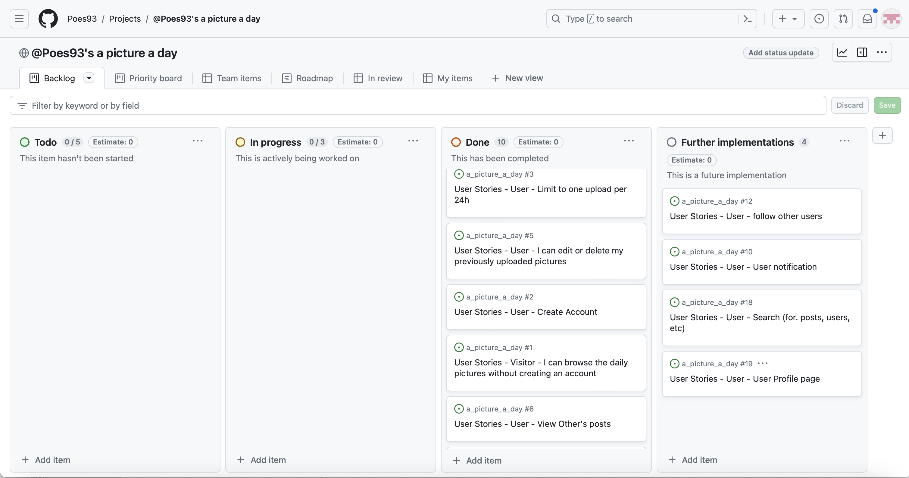
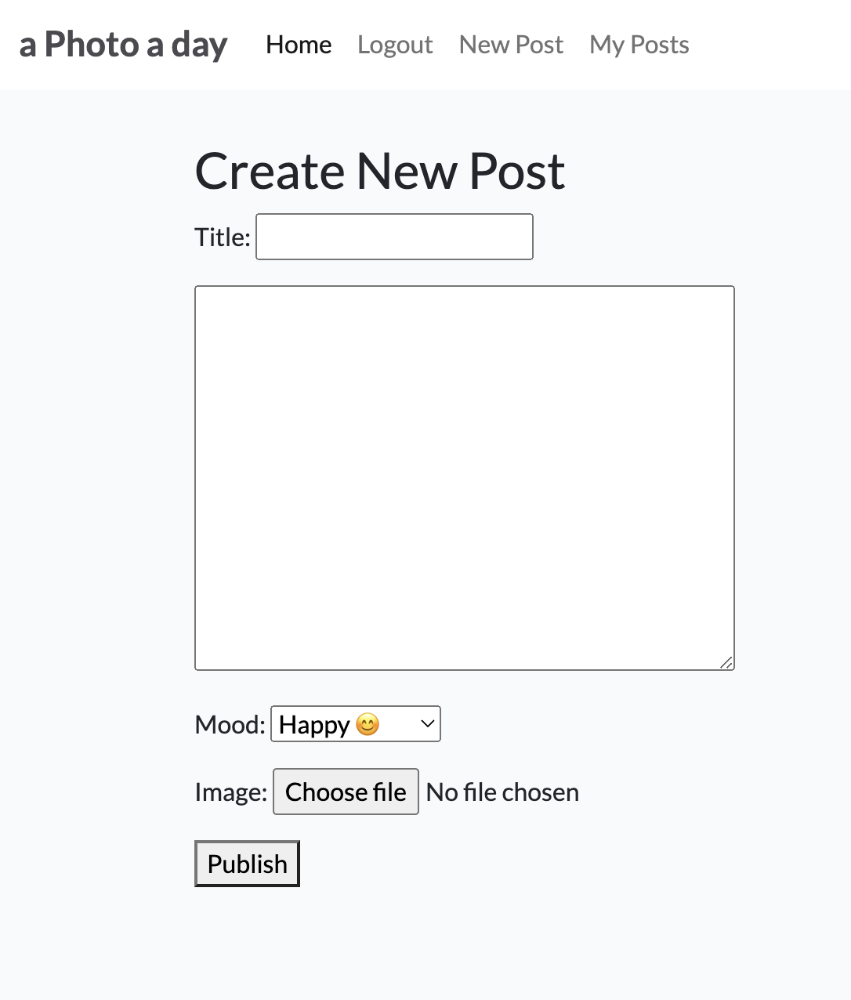
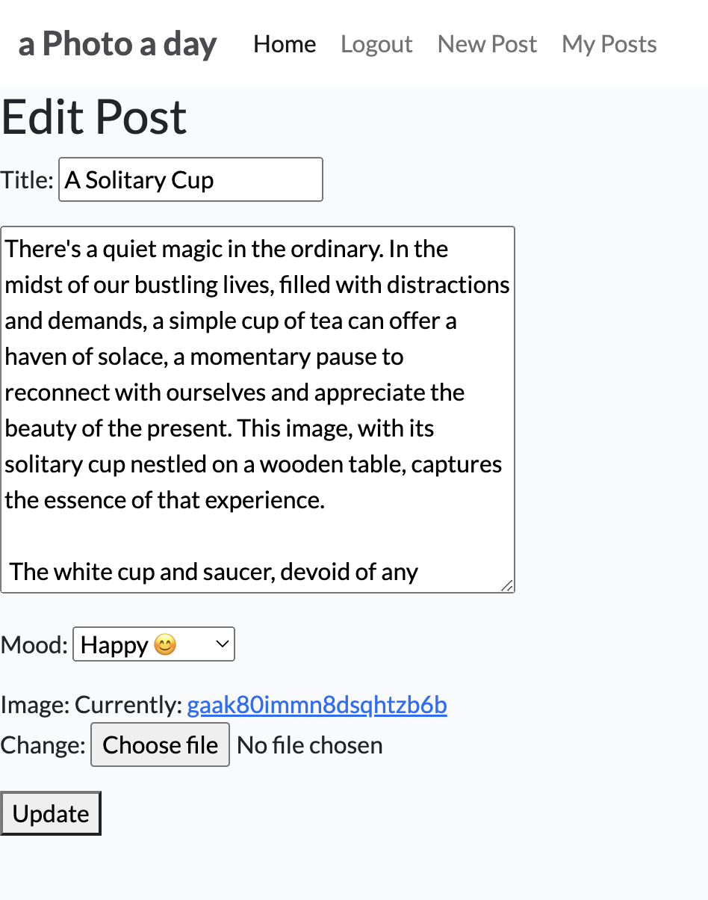
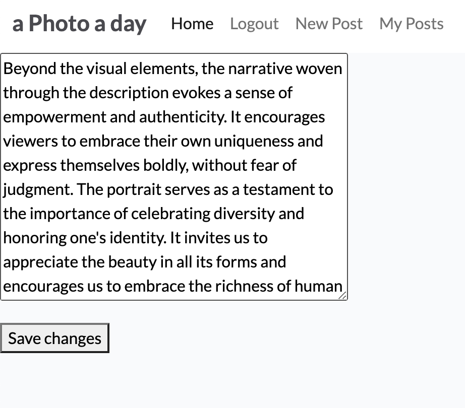
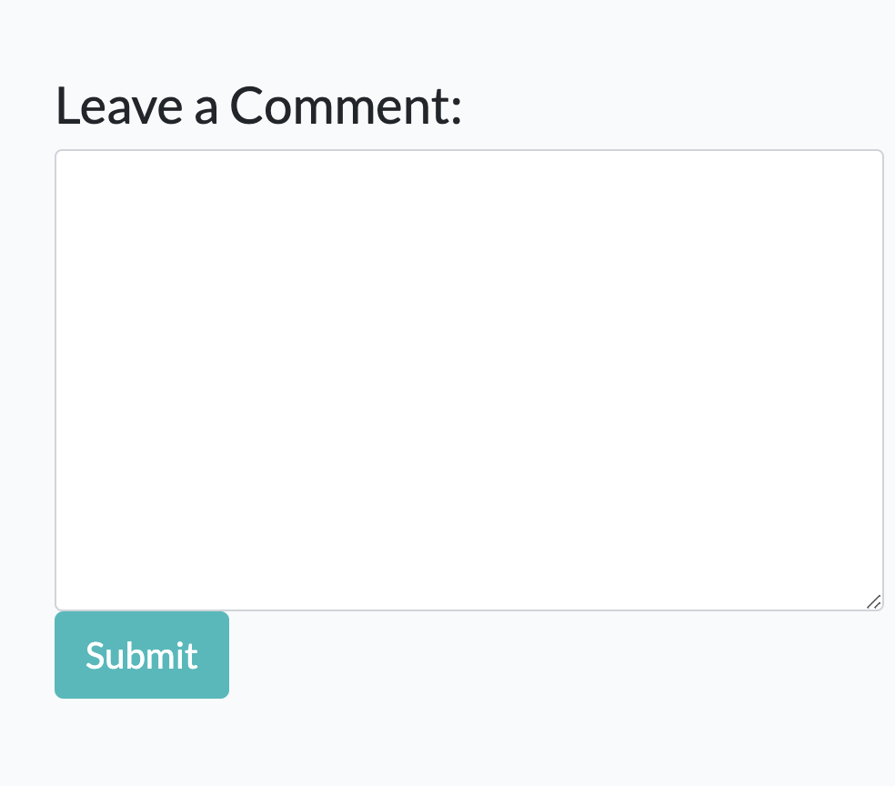
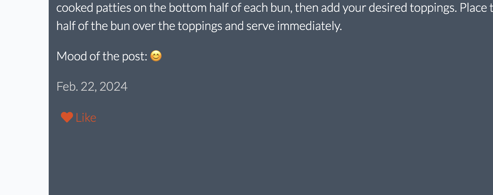
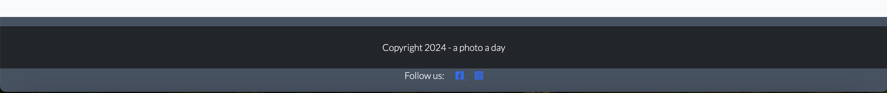
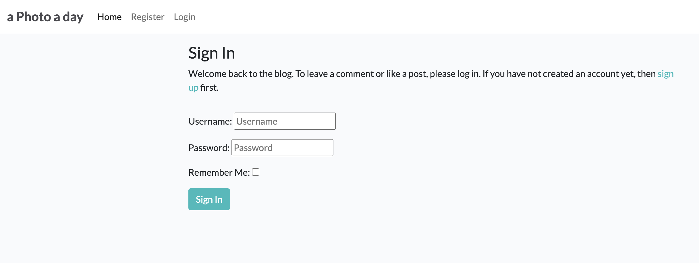
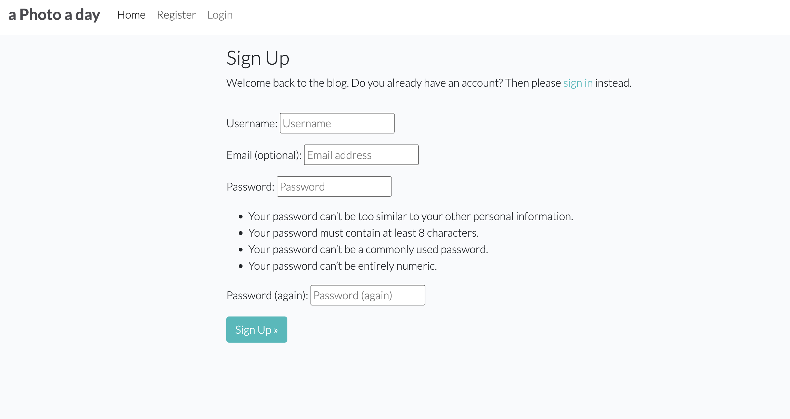
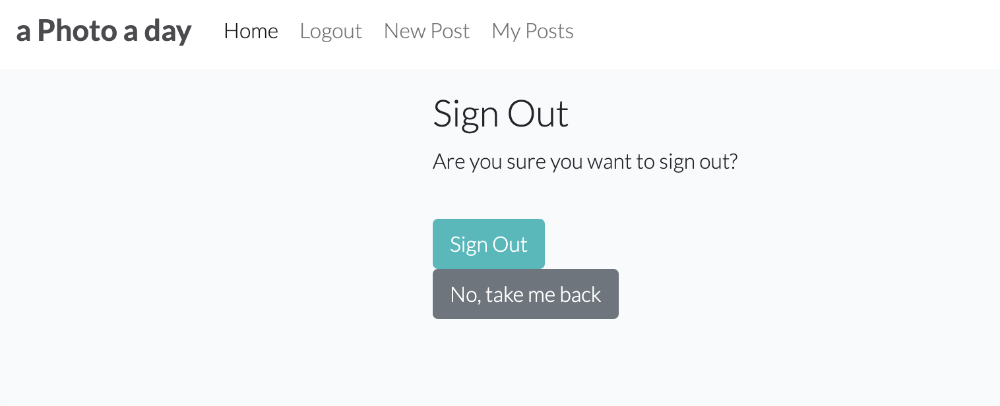

# A photo a day Blog

The A Photo a Day Blog is an interactive hub tailored for photography aficionados, providing a venue for members to showcase their standout daily photo among peers. With a daily posting restriction, users can convey their thoughts and feelings prompted by the image, fostering engagement by exchanging comments and likes within the community.

## Live Site

Explore A photo a day Blog: [Live Site](https://a-picture-a-day-c2fe5b72601e.herokuapp.com/)


## Table of Contents

- [User Experience Design (UX)](#user-experience-design-ux)
  - [The Strategy Plane](#the-strategy-plane)
    - [Site Goals](#site-goals)
    - [Agile Planning](#agile-planning)
      - [Epics](#epics)
      - [User Stories](#user-stories)
  - [The Scope Plane](#the-scope-plane)
  - [The Structure Plane](#the-structure-plane)
    - [Features](#features)
    - [Future Features](#future-features)
  - [The Skeleton Plane](#the-skeleton-plane)
    - [Wireframes](#wireframes)
    - [Database Design](#database-design)
    - [Security](#security)
  - [The Surface Plane](#the-surface-plane)
    - [Design](#design)
      - [Colour Scheme](#colour-scheme)
      - [Typography](#typography)
      - [Imagery](#imagery)
- [Technologies](#technologies)
- [Testing](#testing)
- [Deployment](#deployment)
  - [Version Control](#version-control)
  - [Heroku Deployment](#heroku-deployment)
- [Credits](#credits)
  - [Content](#content)
  - [Acknowledgements](#acknowledgements)

# User Experience Design (UX)

## The Strategy Plane

### Site Goals

A Photo a Day strives to cultivate a lively community where photography enthusiasts can engage, exchange ideas, and explore trends, equipment, and tips. The blog endeavors to empower its members by offering a platform to exhibit their individual journeys and perspectives.

### Agile Planning

Utilizing agile methodologies, the development of A Photo a Day proceeded through iterative updates, with a focus on delivering value at each step. The project was divided into three sprints, with an emphasis on prioritizing essential features initially and then advancing to improve user experience and design.

A detailed Kanban board facilitated task management, visible [here](https://github.com/users/Poes93/projects/4).



#### Epics

- **EPIC 1 - Base Setup:** Establishing the foundational structure for the application.
- **EPIC 2 - Authentication:** Implementing a secure system for user registration and login.
- **EPIC 3 - "Member" Options:** Enabling users to create, manage, and display content created by themselves when logged in.
- **EPIC 4 - "Home Page":** Designing the main landing page to show all content and options for logged in members.
- **EPIC 5 - Deployment:** Launching the application on Heroku for public access.
- **EPIC 6 - Documentation:** Compiling comprehensive documentation and guides for the application.

#### User Stories

User stories were formulated for every epic, concentrating on delivering precise functionalities that correlate with the project's overarching objectives. From the initial setup to deployment and documentation, user stories steered the development process, guaranteeing a user-centric approach.

- **EPIC 1 - Base Setup:**
  - Developer: Establish base.html layout for easy reuse across pages.
  - Developer: Develop static resources for functional images, CSS, and JavaScript.
  - Developer: Configure project for seamless integration of core features.
  - Developer: Design footer with social media links and contact info.
  - Developer: Implement navbar for easy website navigation on all devices.

- **EPIC 2 - Authentication:**
  - Site User: Ability to register a new account.
  - Site User: Ability to sign in if I already have an account on the blog.
  - Site User: See likes, comments and when the post was created.
  - Site User: See a paginated and neat landing page.

- **EPIC 3 - "Member" Options:**
  - Site User: Create new posts.
  - Site User: Edit or Delete posts created by me.
  - Site User: Like a post.
  - Site User: Comment on posts.
  - Site User: Edit or Delete comments created by me.

- **EPIC 4 - "Home Page":**
  - Site User: See a post.
  - Site User: See the comments on a post.
  - Site User: Navigate the blog easily.
  - Developer: Add a navigation bar to make navigation simple.
  - Developer: Add thumbnails to display the image featured in the post.
    
- **EPIC 5 - Deployment:**
  - Developer: Early deployment to ensure functionality.
  - Developer: Deploy project to Heroku to make it accessible online.
  - Developer: Ensure the project contains the correct settings, for example DEBUG = False, when deploying.
 
    
## The Scope Plane

The "A Photo a Day" project is structured as a fully operational blog platform, providing comprehensive features for engagement and content administration, supported by a responsive design to ensure accessibility across all devices.

## The Structure Plane

### Features

- **Navigation Menu:** A user-friendly interface for seamless site exploration.


The Navigation contains links for Home, Posts, Log In, Log Out and has allauth options.

The following navigation items are available.

  * Home -> index.html - View All posts ordered by the creation date
    * Create a Post -> create_post.html - Visible after Registration. 
    * My Posts -> user_posts.html - Visible after registration. List of published post by the logged in user.
  * Login -> login.html - Visible to users that are logged out.
  * Register -> signup.html - Visible to users that are logged out. 
  * Logout -> logout.html - Visible to logged in users.
  
- **Responsive Design:** Ensuring an optimal viewing experience across various devices.
  
- **Member Options:** Users are empowered to craft personalized posts to showcase their photos, with the flexibility to edit or remove their existing content. Additionally, registered users have the ability to vote on posts they appreciate and contribute comments to enhance engagement.

  

  

  
  
- **Interactive Elements:** Like buttons and comment sections to engage the community.

  

  

- **Footer**

A footer has been added to the bottom of the site, this contains links to social media so that users can follow the project and the creator on social media



- **Sign in Page** 



- **Register Account**



- **Log Out confirmation page**



### Future Features

- **Expanded User Interaction:** Introducing search functionality and user profiles aims to elevate community engagement by enabling users to easily discover content and interact with fellow members on a more personalized level.
- **Personalized Content Recommendations:** Personalizing content suggestions based on user preferences and interactions, and enabling category navigation for focused content viewing.

## The Skeleton Plane

### Wireframes

Wireframes were utilized to conceptualize the site layout and user flow, ensuring an intuitive and efficient user experience.

### Database Design

A relational database schema supports the blog's content management and user interaction, with a focus on scalability and security.

### Security

Security measures are implemented to protect user data and ensure a safe community space, adhering to best practices and compliance standards.

## The Surface Plane

### Design

- **Colour Scheme:** A simple yet elegant palette that doesn't overwhelm the site user and instead let the images be the main visual.
- **Typography:** Carefully selected fonts to enhance readability and aesthetic appeal.
- **Imagery:** High-quality images are the blog's main theme, users can also explain their thoughts and feelings inspired by their photo.

## Technologies

A photo a day utilizes a range of technologies, including HTML, CSS, JavaScript for front-end development, and Python Django for the back-end, ensuring a robust and scalable application.

- HTML
The structure of the Website was developed using HTML as the main language.
- CSS
The Website was styled using custom CSS in an external file.
- JavaScript
JavaScript was used to make the Site Pagination.
- Python
Python was the main programming language used for the application using the Django Framework.
- Visual Studio Code
The website was developed using Visual Studio Code IDE.
- GitHub
Source code is hosted on GitHub.
- Git
Used to commit and push code during the development of the Website.
- Font Awesome
This was used for various icons throughout the site.
- Balsamiq
Wireframes were created using balsamiq from [https://balsamiq.com/wireframes/desktop/#].
- Heroku
The application is hosted on [Heroku](https://a-picture-a-day-c2fe5b72601e.herokuapp.com/)

**Python Modules Used**

* Django Class and def function based views (Post List, Post Detail, Comments, Likes, Draft List, own posts Post List).
* Allauth - was used to integrate a set of Django applications addressing authentication, registration and account authentication.
* Alert Messages - Login, Log Out to ensure that the user understands what actions have taken place.

**External Python Modules**

asgiref==3.7.2

bleach==6.1.0

blinker==1.6.3

cachetools==5.3.1

certifi==2023.7.22

cffi==1.16.0

charset-normalizer==3.3.0

click==8.1.7

cloudinary==1.37.0

colorama==0.4.6

coverage==7.3.2

cryptography==41.0.7

defusedxml==0.7.1

dj-database-url==0.5.0

dj3-cloudinary-storage==0.0.6

Django==4.1

django-allauth==0.59.0

django-crispy-forms==1.14.0

django-environ==0.11.2

django-summernote==0.8.20.0

django-taggit==5.0.1

Flask==2.3.0

Flask-SQLAlchemy==2.5.1

google-auth==2.23.2

google-auth-oauthlib==1.1.0

greenlet==3.0.1

gspread==5.11.3

gunicorn==20.1.0

httplib2==0.22.0

idna==3.4

itsdangerous==2.1.2

Jinja2==3.1.2

lolcat==1.4

MarkupSafe==2.1.3

oauth2client==4.1.3

oauthlib==3.2.2

packaging==23.2

psycopg2==2.9.9

psycopg2-binary==2.9.9

pyasn1==0.5.0

pyasn1-modules==0.3.0

pycparser==2.21

pyfiglet==1.0.2

PyJWT==2.8.0

pyparsing==3.1.1

python3-openid==3.2.0

pytz==2023.3.post1

requests==2.31.0

requests-oauthlib==1.3.1

rsa==4.9

setuptools==69.0.3

six==1.16.0

SQLAlchemy==1.4.46

sqlparse==0.4.4

tzdata==2023.3

urllib3==1.26.15

webencodings==0.5.1

Werkzeug==3.0.1

## Testing

Comprehensive testing strategies cover functionality, usability, and performance, ensuring a reliable and user-friendly platform. Check TEST.md for testing information.

## Deployment

### Version Control

Git and GitHub were used for version control, facilitating collaboration and iterative development.

The following git commands were used throughout development to push code to the remote repo:

```git add <file>``` - This command was used to add the file(s) to the staging area before they are committed.

```git commit -m “commit message”``` - This command was used to commit changes to the local repository queue ready for the final step.

```git push``` - This command was used to push all committed code to the remote repository on github.

### Heroku Deployment

The blog is deployed on Heroku, making it accessible to a wide audience. The steps to deploy are as follows:

- Navigate to heroku and create an account
- Click the new button in the top right corner
- Select create new app
- Enter app name
- Select region and click create app
- Click the resources tab and search for Heroku Postgres
- Select hobby dev and continue
- Go to the settings tab and then click reveal config vars
- Add the following config vars:
  - SECRET_KEY: (Your secret key)
  - DATABASE_URL: (This should already exist with add on of postgres)
  - EMAIL_HOST_USER: (email address)
  - EMAIL_HOST_PASS: (email app password)
  - CLOUNDINARY_URL: (cloudinary api url)
- Click the deploy tab
- Scroll down to Connect to GitHub and sign in / authorize when prompted
- In the search box, find the repositoy you want to deploy and click connect
- Scroll down to Manual deploy and choose the main branch
- Click deploy

The app should now be deployed.

The live link can be found here: [Live Site](https://a-picture-a-day-c2fe5b72601e.herokuapp.com/)


## Credits

### Content

The theme is taken from CODESTAR Blog by Code Institute.
The post model is based on the one from CODESTAR Blog, but modified for this project.
The front-end for the confirmation to delete a comment or a post is from [@ispeaklanguage](https://github.com/ispeakfishlanguage/beyond-beauty-blog/)

### Acknowledgements

Special thanks to:
- Daisy McGirr deserves recognition for being an exceptional mentor, always available to provide guidance and support whenever needed.
- “I think therefore I blog” walkthrough: Provided initial steps for setting up & deploying the site.  
- "I think therefore I blog" + "Hello Django" + Slack + Stackoverflow helped in the creation of the totality.