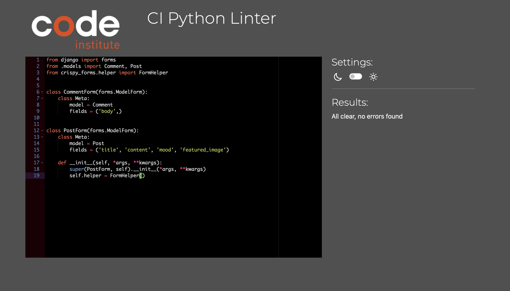
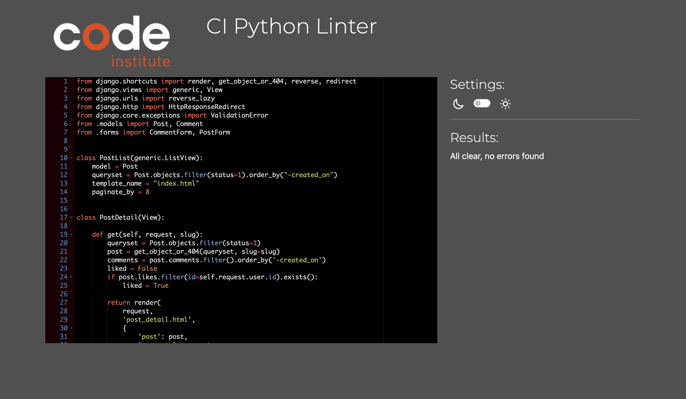

## This is a Document to display tests such as 
* Navigation Links
* Footer Link 
* Py Linter Validator
* Lighthouse Page Analayzer 
* HTML Validator
* CSS Validator

## Navigation Links
All of these links were tested by myself, friends, relatives. 

* Home -> index.html and base.html
* Create a Post -> create_post.html and base.html
* My Posts -> user_posts.html and base.html
* Register - django template signup.html and base.html
* Login - djangop template login.html and base.html
* Logout - django template logout.html and base.html

## Testing messages coinside with the displays in the [README.md](README.md) Alert Section.

### Py Linter

All python pages were run through the official [Pep8](https://pep8ci.herokuapp.com/) validator to ensure all code was pep8 compliant. Some errors were shown due to blank spacing and lines too long, 1 line instead of 2 expected. All of these errors were resolved and code passed through validators.
 
 * admin.py

 
 * apps.py

 

 * forms.py

* urls.py

* models.py 

* views.py 

## Lighthouse Performance

## HTML Validator 

All pages were run through the [w3 HTML Validator](https://validator.w3.org/). Initially there were some errors due to stray script tags, misuse of headings within spans and some unclosed elements. All of these issues were corrected and all pages passed validation.

Due to the django templating language code used in the HTML files, these could not be copy and pasted into the validator and due to the secured views, pages with login required or a secured view cannot be validated by direct URI. To test the validation on the files, open the page to validate, right click and view page source. Paste the raw html code into the validator as this will be only the HTML rendered code.

* base.html and index.html were done at the same time as index.html rests in base.html

* Sign in was tested

* Log Out was tested

* Register

## CSS Validator

* CSS Validator

